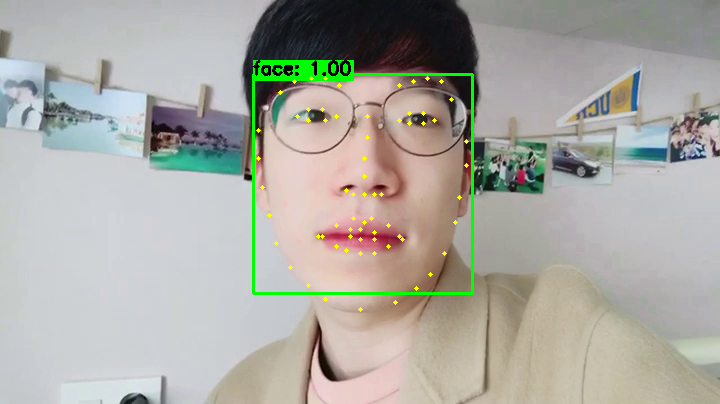

# Awesome face landmark

Compare face landmark - dlib, caffe, others..
 
 

    
     
    SSD with face-alignment result

---

 

## Processing time

Test image size : 720x404

**Detector** : opencv dnn(caffe import) - resnet-SSD

**Landmarker**

- caffe: https://github.com/lsy17096535/face-landmark
- dlib: http://dlib.net/face_landmark_detection.py.html
- face-alignment: https://github.com/1adrianb/face-alignment

 
Detector resize image

    ocv-dnn : 300x300

Test on **Intel i7-6700K & GTX1080**.

TO BE ADDED

 

Test on **MacBook pro retina 2014 mid**.

TO BE ADDED

 

## Requirements

- Python 3.6
- OpenCV 3.4.0.14 (option: build from src with highgui)
- scipy
- Dlib 19.13
- pytorch 0.4.0

## Usage  

First, install libs

    pip install opencv-contrib-python
    pip install torch
    pip install dlib
    pip install scipy

Second, check run-time for each algorithm.

T.B.A

---

## Reference

T.B.A

opencv caffe based dnn (res-ssd)
 - https://github.com/opencv/opencv/tree/master/samples/dnn

dlib
 - http://dlib.net/
